# 📋 TeamFlow Worklog

A sample business-workflow frontend built on React, TypeScript, Apollo Client/GraphQL, and Redux
Toolkit: employees log a daily work schedule and an end-of-day work update, and their team lead
reviews, approves, or rejects each one. It exists to show the pattern end to end - role-based
views, an OTP-style login flow, typed data fetching through Redux, and explicit loading/error
states - rather than to be a product in its own right.

> This is a portfolio/demo repository. There is no private backend: every GraphQL request is
> served locally by a [Mock Service Worker](https://mswjs.io/) layer with realistic sample data,
> so the app runs fully standalone.

## ✨ Features

- **Role-based work planning** - employees plan a daily schedule and file an end-of-day update;
  team leads get everything employees get, plus a dedicated Approvals queue.
- **OTP-style authentication** - username/password followed by a 6-digit one-time passcode, with
  its own loading state and a real "invalid code" error path (not just a happy-path stub).
- **A real approval workflow** - each work update carries a `pending | approved | rejected`
  status; approving or rejecting from the team lead's queue updates the employee's own view,
  including an optional reviewer note.
- **Apollo Client + GraphQL throughout** - every query and mutation is a real `gql` document
  against a real Apollo Client instance; nothing is faked at the component level.
- **Redux Toolkit for app state** - one `createAsyncThunk`-backed slice per data domain
  (user, schedule, projects, task types, approvals), each with its own `loading`/`error` state.
- **Explicit loading and error states** - GraphQL failures surface as real UI, not a silent stall
  (see the `error` branch in `src/pages/todayTimesheet/index.tsx`).
- **Runtime-validated configuration** - `VITE_GRAPHQL_API_URL` is parsed through a zod schema
  before the app trusts it (`src/config/env.ts`).
- **Accessible by default** - real `<button>`/`<Link>` elements instead of anchor-as-button
  patterns, labelled form controls, and `alt` text on every meaningful image (jsx-a11y enforced).
- **Strict TypeScript** - no `any` anywhere, the full `strict` compiler family plus
  `exactOptionalPropertyTypes`/`noUncheckedIndexedAccess`, zero-warning ESLint.

## 📸 Screenshots

All captured from the app running locally against the mock GraphQL layer (`npm run dev`), walking
through both sample accounts end to end.

### Authentication

|                                                                                 |                                                                               |
| ------------------------------------------------------------------------------- | ----------------------------------------------------------------------------- |
| 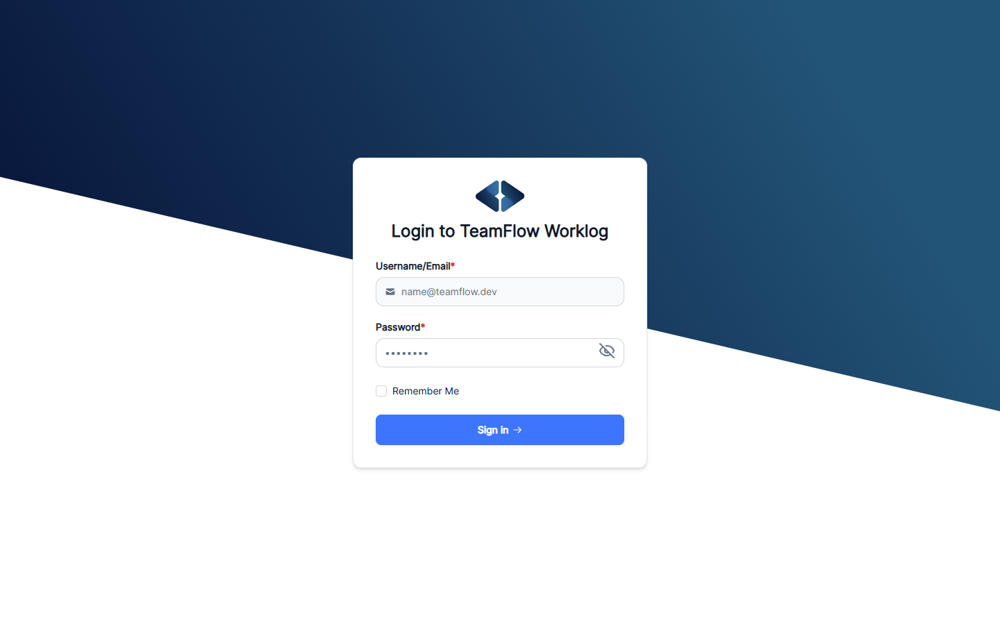                                     | 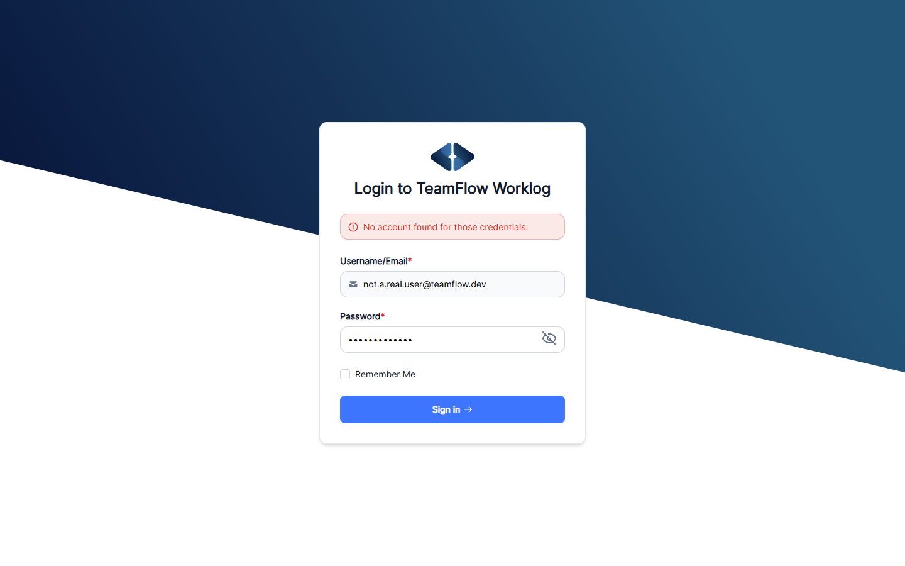  |
| The login screen.                                                               | A failed login - the error renders inline on the form, not as a corner toast. |
| 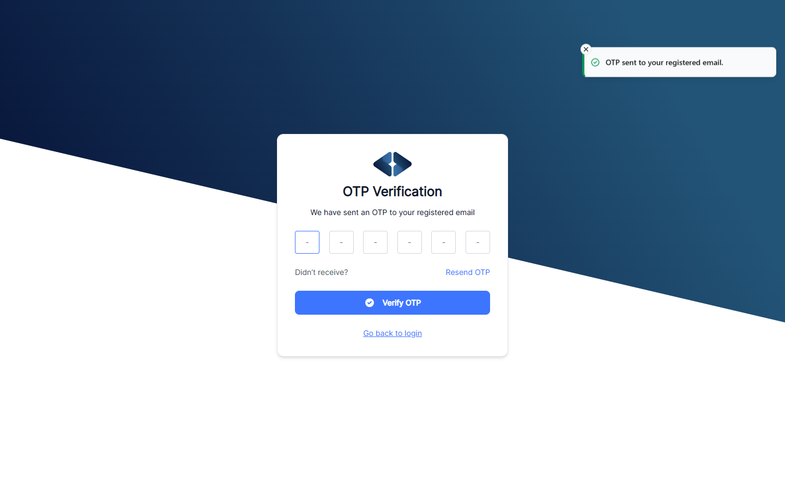               |                                                                               |
| The 6-digit OTP step, with the "OTP sent" confirmation toast visible top-right. |                                                                               |

### Employee view (`jordan.rivera`)

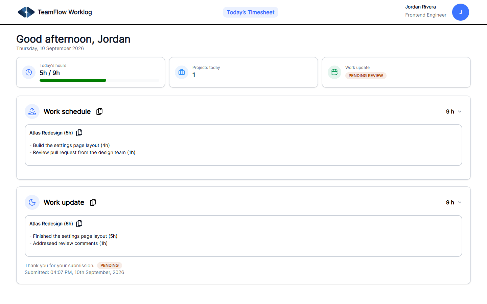

Today's stats, the submitted work schedule, and a work update already sitting at **pending**
review.

### Team lead view (`morgan.lee`)

|                                                                                                       |                                                                                                                          |
| ----------------------------------------------------------------------------------------------------- | ------------------------------------------------------------------------------------------------------------------------ |
| 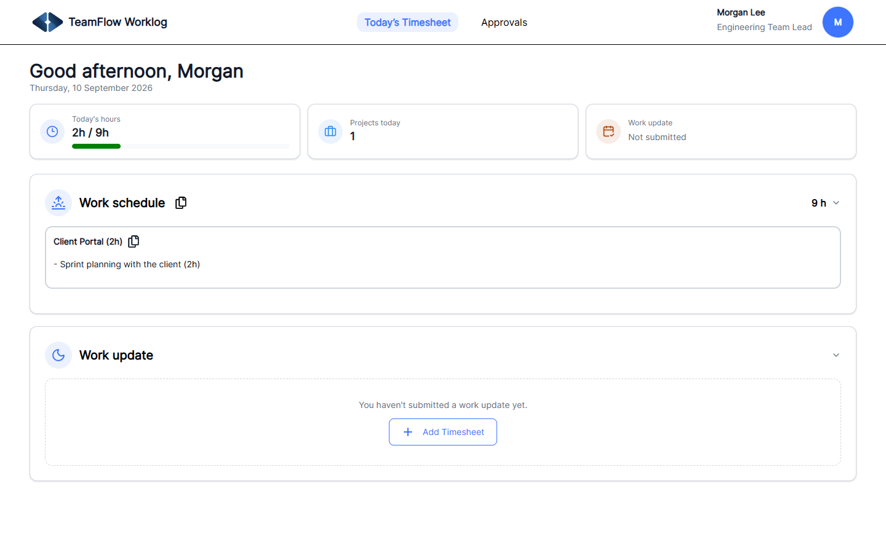 | The team lead's own timesheet - note the extra **Approvals** nav item, and the empty work-update state's call to action. |
| 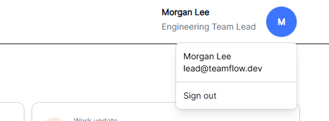                                    | The profile menu.                                                                                                        |

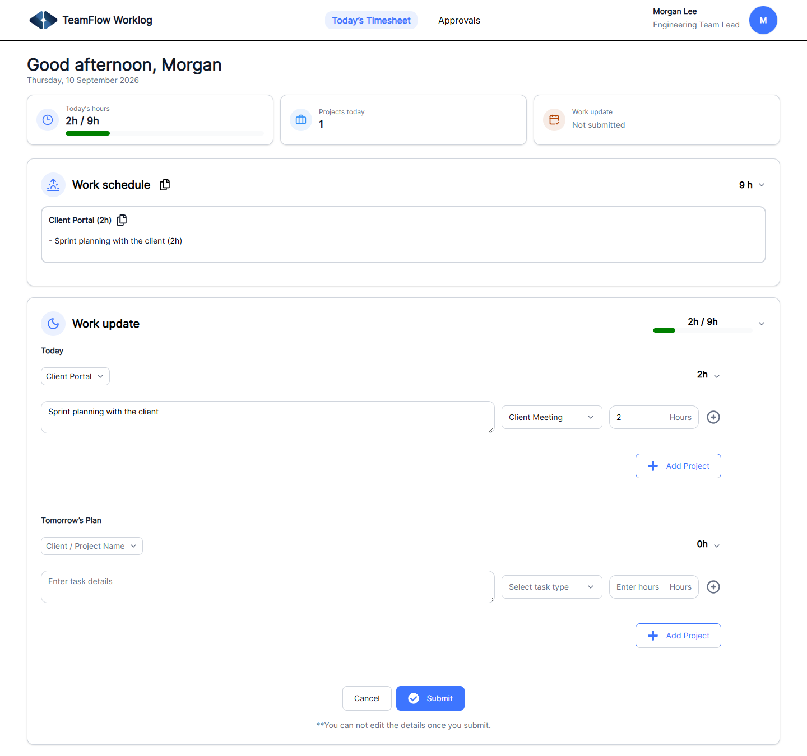

Filling in a work update: project and task-type selects, an hours field, and a second
"Tomorrow's Plan" section, all in a responsive grid that never overflows its card.

### Approval workflow

|                                                                                   |                                                                                          |
| --------------------------------------------------------------------------------- | ---------------------------------------------------------------------------------------- |
| 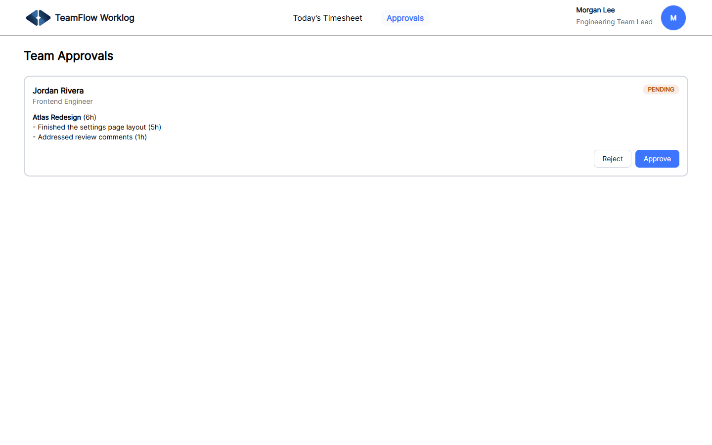 | The Approvals queue, with Jordan Rivera's update awaiting review.                        |
| 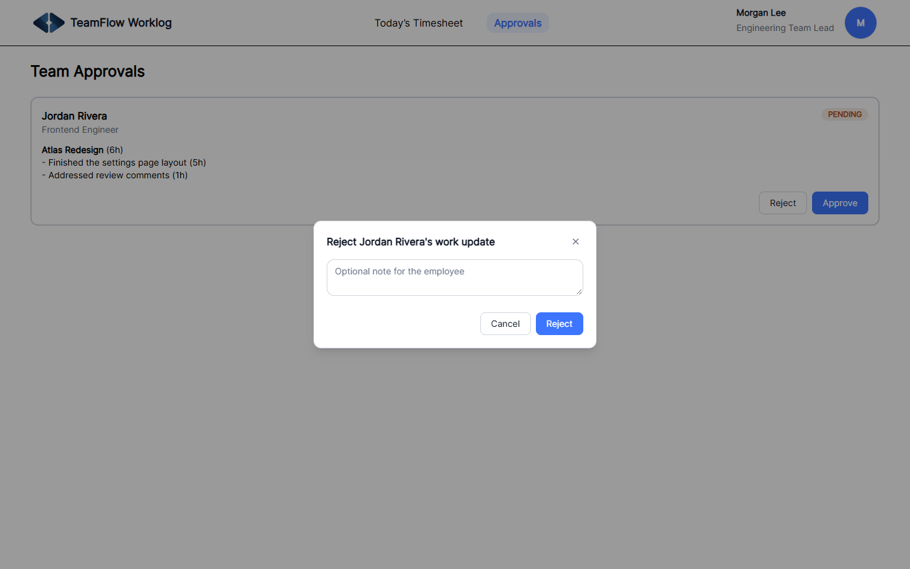  | Rejecting a work update, with an optional note back to the employee.                     |
| 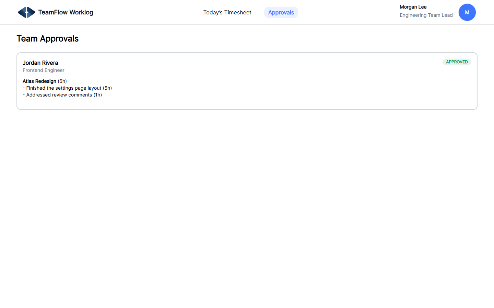  | The same entry right after approval - the status badge updates in place, no page reload. |

## 🧰 Tech stack

| Technology                                    | Role                                                                          |
| --------------------------------------------- | ----------------------------------------------------------------------------- |
| React 19                                      | UI                                                                            |
| TypeScript 6 (strict)                         | Type safety                                                                   |
| Vite                                          | Dev server and production build                                               |
| Apollo Client / GraphQL                       | Data fetching and caching                                                     |
| Redux Toolkit                                 | Application state, per-domain slices                                          |
| [Base UI](https://base-ui.com) + Tailwind CSS | Headless UI primitives styled as this app's own `component/ui/` design system |
| [Sonner](https://sonner.emilkowal.ski/)       | Toast notifications                                                           |
| lucide-react                                  | Icons                                                                         |
| Zod                                           | Runtime validation (env vars, mock variables)                                 |
| MSW (Mock Service Worker)                     | Standalone mock GraphQL backend                                               |
| Vitest + Testing Library                      | Unit and integration tests                                                    |
| ESLint, Prettier, Husky, commitlint, Gitleaks | Code quality and security gates                                               |

## 🏗️ Architecture

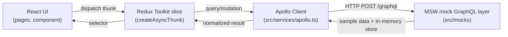

Most screens go through a Redux thunk (`src/redux/slice/*`), but a few - the login/OTP flow and
adding a work plan - call Apollo's `useMutation` directly from the component, since that state is
local to the form rather than shared app state. Either way, every request lands on the same
`APOLLO_CLIENT` instance and the same MSW handlers, so the flow is identical in dev, in tests, and
in this deployed demo. Point `VITE_GRAPHQL_API_URL` at a real GraphQL endpoint (see
[Environment variables](#environment-variables)) to swap the mock layer for a live backend - no
other code changes needed.

## 📁 Project structure

```text
src/
  component/     Presentational + feature components - header, work-plan forms, team-approvals
    ui/          Shared design system - button, input, select, dialog, accordion, toast, etc.,
                 built on Base UI primitives and this app's Tailwind tokens (src/index.css)
  pages/         Route-level screens - authentication, todayTimesheet, teamApprovals
  graphql/       gql query/mutation documents, one file per domain
  redux/slice/   Redux Toolkit slices + async thunks, one per data domain
  mocks/         MSW handlers, sample data, browser/node worker setup
  services/      Apollo Client setup
  config/        Runtime environment validation (env.ts)
  types/         Shared TypeScript types
  test/          Test setup + render helpers
  route/         Route table
```

## 🔄 Data flow

**Submitting a work update:**

```text
AddSchedule (Submit)
  -> useMutation(SUBMIT_SCHEDULE)
  -> Apollo Client -> POST /graphql
  -> MSW CreateTaskEntry handler writes the in-memory store, status: "pending"
  -> dispatch(fetchEmployeeWorkPlan) refetches
  -> TodayTimesheet re-renders with the new entry and its status badge
```

**A team lead approving it:**

```text
TeamApprovals (Approve)
  -> dispatch(reviewWorkPlan({ entryId, status: "approved" }))
  -> Apollo Client -> POST /graphql
  -> MSW ReviewWorkPlan handler updates the same in-memory entry
  -> team-approval slice updates that entry's status locally
  -> next time the employee loads their timesheet, the status badge reflects it
```

## 🔑 Environment variables

| Variable               | Purpose                                                                                                                      |
| ---------------------- | ---------------------------------------------------------------------------------------------------------------------------- |
| `VITE_GRAPHQL_API_URL` | GraphQL endpoint. A relative path (default `/graphql`) is served by the mock layer; an http(s) URL points at a real backend. |

`.env.example` documents this. `src/config/env.ts` validates it via zod at startup and throws a
single generic error if it's malformed, so a bad value never leaks into a raw URL-parsing error.
Nothing here is secret - there's no real backend to protect credentials for in this demo.

## 🎭 Mock GraphQL layer

`src/mocks/handlers.ts` intercepts every GraphQL operation the app makes and answers from an
in-memory store (`src/mocks/data.ts`), validating incoming mutation variables through zod instead
of trusting them - the same discipline a real resolver layer would apply:

- **Two seeded accounts** - an employee and a team lead (see
  [Sample accounts](#sample-accounts)) - `GetUser` resolves the signed-in viewer from the
  `Authorization` header the mock login flow issues.
- **Stateful mutations** - `CreateTaskEntry` and `ReviewWorkPlan` actually mutate the in-memory
  store, so approving a work update or adding a new one is reflected on the next query, for the
  rest of the browser session.
- **A GraphQL error is reachable on demand** - tests override a handler with `server.use(...)` to
  simulate a failed query rather than baking a permanent failure into the mock.

Because this is a mock layer, not a schema-validated server, it trusts the shape of `.graphql.ts`
documents it's given rather than enforcing a real GraphQL schema.

## 👤 Role-based UI

|                                      | Employee | Team lead               |
| ------------------------------------ | -------- | ----------------------- |
| Log daily work schedule / update     | ✅       | ✅ (for their own work) |
| See their own update's review status | ✅       | ✅                      |
| "Approvals" nav item                 | -        | ✅                      |
| Review team's pending updates        | -        | ✅                      |
| Approve / reject with a note         | -        | ✅                      |

Role is read from the logged-in user's `userrole` (returned by the `GetUser` query) and checked at
both the nav-link and route level (`src/pages/teamApprovals/index.tsx` redirects a non-team-lead
back to `/`).

### Sample accounts

The mock layer ships two accounts. Any password works; the OTP code is always **`123456`**.

| Role      | Username or email                         |
| --------- | ----------------------------------------- |
| Employee  | `employee@teamflow.dev` / `jordan.rivera` |
| Team lead | `lead@teamflow.dev` / `morgan.lee`        |

Log in as the team lead to see Jordan Rivera's sample work update already sitting in the Approvals
queue.

## 💻 Local development

Requires Node `>=24 <25` and npm `>=11 <12` (see `.nvmrc` / `engines` in `package.json`), plus
[Gitleaks 8.30.x](https://github.com/gitleaks/gitleaks/releases/tag/v8.30.1) on `PATH` before your
first commit - the pre-commit hook refuses to run without it.

```bash
npm install
npm run prepare   # wires up the Husky git hooks (run once after cloning)
```

### 🎭 Run against the mock GraphQL layer (default)

No environment variables are required - `npm run dev` starts the app at `http://localhost:5173`
already backed by MSW's sample data.

```bash
npm run dev
```

### 🌐 Point at a real GraphQL backend

```bash
cp .env.example .env
# set VITE_GRAPHQL_API_URL to your backend's http(s) endpoint
npm run dev
```

The rest of the app - Apollo Client, the Redux slices, every component - is unchanged; only the
mock layer is bypassed.

## ⚙️ Available commands

| Command                           | Purpose                                                            |
| --------------------------------- | ------------------------------------------------------------------ |
| `npm run dev`                     | Start the Vite dev server.                                         |
| `npm run build`                   | Type-check and produce a production build (output in `dist/`).     |
| `npm run preview`                 | Preview the production build locally.                              |
| `npm run quality`                 | Format check, lint, and typecheck (what the pre-commit hook runs). |
| `npm run format` / `format:check` | Prettier write / check.                                            |
| `npm run lint`                    | ESLint, zero warnings allowed.                                     |
| `npm run typecheck`               | `tsc`.                                                             |
| `npm test`                        | Vitest with coverage.                                              |
| `npm run test:watch`              | Vitest in watch mode.                                              |
| `npm run security:audit`          | `npm audit --omit=dev --audit-level=high`.                         |

## 🧪 Testing

`npm test` runs the full suite (10 tests) against the same MSW handlers the app itself uses (via
`msw/node`), so they exercise the real Apollo Client → Redux → UI flow rather than mocked
components. Coverage thresholds (90% statements, 85% branches, 100% functions, 90% lines) are
enforced in `vite.config.ts`, scoped to `src/config/env.ts` - currently 100% across the board:

- `src/pages/authentication/__tests__/authentication.test.tsx` - the login → OTP happy path, and
  an invalid OTP surfacing an inline form error without ever storing a token.
- `src/component/work-plan/__tests__/add-schedule.test.tsx` - adding a new work schedule end to
  end: filling the project/task-type selects and hours field, submitting, and seeing it rendered.
- `src/pages/teamApprovals/__tests__/team-approvals.test.tsx` - a team lead approving a pending
  work update and the status badge updating in place.
- `src/pages/todayTimesheet/__tests__/error-state.test.tsx` - a GraphQL error overridden via
  `server.use(...)` surfacing as real UI instead of a silent stall.
- `src/config/env.test.ts` - valid configuration (unset, a relative path, an http(s) URL) parses
  correctly; a malformed or disallowed-protocol value throws one generic error that never contains
  the value supplied.

## 🔒 Code quality and security

This repo follows the Webvoltz React engineering standards: strict TypeScript (no `any`, the full
`strict` compiler family, `exactOptionalPropertyTypes`, `skipLibCheck: false`), a flat ESLint
config with type-aware rules plus React/hooks/a11y plugins, Prettier, and exact pinned dependency
versions. A Husky pre-commit hook runs Gitleaks secret scanning, `lint-staged`, the full `quality`
check, and a production build before any commit is allowed through; `commit-msg` enforces
Conventional Commits via commitlint. The same gates run in CI (`.github/workflows/ci.yml`) - secret
scan and dependency audit first, then quality and commit-message lint, then tests, then the
production build.

`skipLibCheck: false` means every third-party `.d.ts` is type-checked too, not just this project's
own code. Only one dependency fails that check on its own terms: `@reduxjs/toolkit`'s bundled types
don't satisfy `exactOptionalPropertyTypes` (confirmed upstream - a maintainer's stance is that
consumers should set `skipLibCheck: true`, which this project deliberately doesn't). A single
patch-package patch (`patches/@reduxjs+toolkit+*.patch`) fixes just that file's types rather than
relaxing the project-wide setting. `security:audit` runs with `--omit=dev`, since the only
remaining advisories are in build/test-only tooling (the esbuild/vite/vitest chain) that's never
shipped.

## 🧠 Design decisions

- **A small in-house `component/ui/` layer instead of a component library** - `Button`, `Input`,
  `Select`, `Dialog`, `Accordion`, `Toast`, etc. are thin wrappers around
  [Base UI](https://base-ui.com)'s unstyled interaction primitives, styled with Tailwind and this
  app's own design tokens (`src/index.css`). There's no visual component library dependency (the
  app used to ship Ant Design; it was fully removed) - only headless behavior plus this project's
  own styling, so the look is never dictated by someone else's defaults.
- **Sonner for toasts, not a hand-built one** - toast notifications need real polish (enter/exit
  animation, swipe-to-dismiss, stacking, auto-dismiss timing) that isn't worth reinventing on top
  of a headless primitive; `src/utils/notify.ts` wraps Sonner's own imperative `toast()` API behind
  `notify.success/error/open()` so the rest of the app never imports Sonner directly.
- **Inline form errors, not toasts, for login/OTP failures** - a failed sign-in or OTP check
  renders as an `Alert` inside the form itself (see `pages/authentication/login.tsx`), right next
  to the field the user needs to fix, instead of a notification in the corner of the screen.
- **MSW over a hand-rolled fake client** - MSW intercepts the real network calls Apollo Client
  makes, so the app, its tests, and a future real backend all go through the exact same Apollo
  Client → GraphQL document code path; nothing is mocked at the component level.
- **Zod at the mock boundary too** - the mock GraphQL layer validates incoming mutation variables
  with zod instead of blind type assertions, so a malformed request fails loudly and safely
  instead of producing an unsafe cast.
- **Status lives on the "update" submission, not per-project** - approval is modeled as a review
  of the employee's end-of-day report as a whole, matching how a team lead actually reviews it.
- **A full page reload on sign-out** - rather than a client-side `navigate`, so the Redux store and
  Apollo cache never carry a signed-out user's data into the next session.
- **Refs, not suppressed lint rules, for "read the latest value without depending on it"** - the
  "copy from yesterday" effect in `add-schedule.tsx` reads the current work plan via a ref instead
  of adding it as a dependency (which would re-run the effect on every unrelated update) or
  disabling `react-hooks/exhaustive-deps`.

## 🐛 Troubleshooting

- **Blank page with a console error on load** - `VITE_GRAPHQL_API_URL` failed zod validation in
  `src/config/env.ts` (for example, a non-http(s) value with no leading `/`). Fix `.env` and
  restart `npm run dev`.
- **Env vars not taking effect** - Vite only reads `.env` at startup; restart `npm run dev` after
  editing it.
- **Login works but OTP always fails** - the mock OTP code is always `123456`; any other 6-digit
  code is treated as invalid by design (see `src/mocks/handlers.ts`).
- **A newly-added work plan doesn't show up** - the submit button is disabled while
  `submitScheduleMutation` is in flight; wait for it to resolve rather than double-submitting.
- **Pre-commit hook fails immediately** - it refuses to run without Gitleaks on `PATH`
  (`gitleaks version` should print `8.30.x`); see
  [Code quality and security](#code-quality-and-security).

## 🚀 Future improvements

- A richer approval history (past decisions and notes, not just the current status).
- Per-project time allocation reporting for team leads.
- Real backend integration guide once a production GraphQL API exists.
- Notifications when a work update is reviewed.

## 📄 License

Portfolio/demonstration repository - no license file is included.
