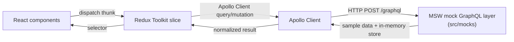

# TeamFlow Worklog

TeamFlow Worklog is a sample business-workflow frontend: employees log a daily **work schedule** and an end-of-day **work update**, and their team lead **reviews, approves, or rejects** each update. It's built to demonstrate a realistic React + GraphQL + Redux Toolkit stack — role-based views, an OTP-style login flow, optimistic-feeling data loading, and explicit error states — without depending on any real backend.

> This is a portfolio/demo repository. There is no private backend: every GraphQL request is served locally by a [Mock Service Worker](https://mswjs.io/) layer with realistic sample data, so the app runs fully standalone.

## Business workflow

1. **Employee logs in** with a username/password, then confirms a one-time passcode (OTP) sent to their email.
2. **Employee plans their day** — adds projects and tasks to today's *work schedule*.
3. **Employee reports progress** — at day's end, submits a *work update* (what got done) plus a plan for *tomorrow*. The update enters `pending` review.
4. **Team lead reviews the queue** — the Approvals view lists every pending work update from their team, with **Approve** or **Reject** (with an optional note).
5. **Employee sees the outcome** — their submitted update shows a status badge (`Pending` / `Approved` / `Rejected`) and the reviewer's note, if any.

## Data flow



- **UI components** (`src/pages`, `src/component`) never call GraphQL directly — they dispatch a Redux Toolkit `createAsyncThunk` (`src/redux/slice/*`).
- Each thunk calls **Apollo Client** (`src/services/apollo.ts`) with a query/mutation from `src/graphql/*.graphql.ts`.
- In development, testing, and this deployed demo, Apollo's HTTP requests are intercepted by **MSW** (`src/mocks/handlers.ts`), which serves data from an in-memory store (`src/mocks/data.ts`) seeded with sample employees, projects, and work plans. Approvals actually mutate that store, so state persists for the rest of the session.
- Point `VITE_GRAPHQL_API_URL` at a real GraphQL endpoint (see [`.env.example`](.env.example)) to swap the mock layer for a live backend — no other code changes needed.
- Loading and error states are handled explicitly at each layer: thunks catch and store `{ message }` errors, and components branch on `loading`/`error` from the slice (see `src/pages/todayTimesheet/index.tsx`).

## Role-based UI

| | Employee | Team lead |
|---|---|---|
| Log daily work schedule / update | ✅ | ✅ (for their own work) |
| See their own update's review status | ✅ | ✅ |
| "Approvals" nav item | — | ✅ |
| Review team's pending updates | — | ✅ |
| Approve / reject with a note | — | ✅ |

Role is read from the logged-in user's `userrole` (returned by the `GetUser` query) and checked at both the nav-link and route level (`src/pages/teamApprovals/index.tsx` redirects a non-team-lead back to `/`).

### Sample accounts

The mock layer ships two accounts. Any password works; the OTP code is always **`123456`**.

| Role | Username or email |
|---|---|
| Employee | `employee@teamflow.dev` / `jordan.rivera` |
| Team lead | `lead@teamflow.dev` / `morgan.lee` |

Log in as the team lead to see Jordan Rivera's sample work update already sitting in the Approvals queue.

## Tech stack

React 18 · TypeScript · Vite · Apollo Client · GraphQL · Redux Toolkit · Ant Design · Tailwind CSS · MSW · Vitest · React Testing Library

## Getting started

```bash
npm install
npm run dev       # starts the app at http://localhost:5173, backed by the mock GraphQL layer
```

No environment variables are required to run locally — see [`.env.example`](.env.example) if you want to point at a real backend instead.

### Other scripts

```bash
npm run build      # type-check and produce a production build
npm run preview     # preview the production build locally
npm run lint        # ESLint
npm test            # run the test suite once (Vitest)
npm run test:watch  # run tests in watch mode
```

## Testing

Tests use Vitest, React Testing Library, and the same MSW handlers as the app (via `msw/node`), so they exercise the real Apollo Client → Redux → UI flow rather than mocked components. Coverage includes:

- Login → OTP happy path and an invalid-OTP error state
- Adding a new work schedule end to end
- A team lead approving a pending work update
- A GraphQL error surfacing in the UI

## Project structure

```
src/
├─ component/     # Presentational + feature components (header, work-plan forms, team-approvals, ...)
├─ pages/          # Route-level screens (authentication, todayTimesheet, teamApprovals, ...)
├─ graphql/        # gql query/mutation documents, one file per domain
├─ redux/slice/    # Redux Toolkit slices + async thunks (one per data domain)
├─ mocks/          # MSW handlers, sample data, browser/node worker setup
├─ services/       # Apollo Client setup
├─ types/          # Shared TypeScript types
├─ test/           # Test setup + render helpers
└─ route/          # Route table
```

## Screenshots

| Login | Employee's daily timesheet | Team lead's approval queue |
|---|---|---|
|  |  |  |
